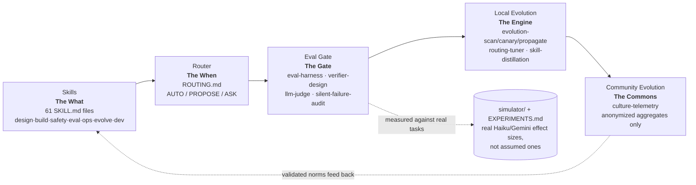

# Agent Skills - Community Loops

> **TL;DR**
>
> **Why this exists.** Agent engineering knowledge today is *folklore* — prompt tricks and topology tips that live in people's heads and blog posts, spread by imitation rather than evidence, and silently stale the moment a new model ships. Every team re-derives the same lessons; hard-won practice evaporates at the end of a session; and a skill sitting in a folder nobody remembers to invoke is shelfware. This library closes that loop end to end, five parts working together: **skills** capture production-grade agent practice as checkable procedures ([the "What"](docs/skills_doc.md)); a **router** fires the right one at the right moment without being asked ([the "When"](docs/routing_doc.md)); an **eval gate** proves a skill actually helps, on real tasks, before it ships or stays ([the "Gate"](docs/evals_doc.md)); **local evolution** turns your own routing logs and eval results into gated fixes for your own skills ([the "Engine"](docs/evolve_doc.md)); and **community evolution** validates what works across everyone's model generation from anonymized aggregates alone — no prompt, trace, or implementation ever leaves your machine ([the "Commons"](docs/telemetry_doc.md)).
>
> **What it is.** **61 vendor-neutral `SKILL.md` skills for building and operating AI agents**, spanning the whole lifecycle (`design · build · safety · eval · ops · evolve · dev`). Run `./install.sh` (or point any agent at [INSTALL.md](INSTALL.md) and say "install this"); works in any tool that reads a skills directory — Claude Code, Antigravity, Codex, Gemini CLI, Cursor, Grok, and 30+ more.
>
> **What makes it different.** It's **self-driving** — a router ([ROUTING.md](skills/ROUTING.md)) fires the right skill from what you're actually doing, with AUTO / PROPOSE / ASK tiers so you keep control instead of memorizing dozens of commands. It's **checked** — skills are measured against real held-out tasks, not assumed to help; a skill that regresses gets caught and gated, not shipped on faith. And it **learns**, at two scopes — locally, every routing decision is logged and mistakes become gated fixes to your own `ROUTING.md`/skills; and communally, (on by default, fully anonymized) daily aggregates feed a public commons of what actually works, per model generation ([telemetry_doc.md](docs/telemetry_doc.md)). Per-skill reference: [skills_doc.md](docs/skills_doc.md).

A production-ready, **vendor-neutral** skill library for **building and operating AI agents**. Each skill is a directory containing a `SKILL.md` with YAML frontmatter, conforming to the open [Agent Skills standard](#compatibility) — it runs unchanged in any skill-capable agent environment (Claude Code, Google Antigravity, OpenAI Codex, Gemini CLI, Cursor, Windsurf, Cline, and 30+ others). Nothing in this repo is tied to a specific model or vendor.

Skills are organized by **lifecycle stage** — the moment in work when you reach for them:

| Group | Stage | Skills |
|-------|-------|--------|
| `skills/design/` | Before code exists | requirements-interrogation, agent-architecture, long-horizon-brief, prompt-architecture, tool-design, tool-adversarial-reading, handoff-protocol |
| `skills/build/` | While writing the agent | skill-authoring, mcp-server, memory-design, context-engineering, context-degradation, retrieval-design, state-management, grounding-citation, multimodal |
| `skills/safety/` | Before anything touches prod | guardrails, injection-audit, sandbox-policy, privacy, secrets-management, agent-identity, supply-chain-vetting, output-safety, compliance-mapping |
| `skills/eval/` | Is it actually good? | adversarial-review, eval-harness, verifier-design, trajectory-review, llm-judge, model-card, silent-failure-audit, synthetic-task-generation |
| `skills/ops/` | Running in production | agent-observability, cost-optimization, agent-incident, human-review-escalation, reliability-engineering, deployment, model-migration, latency-optimization, model-routing, cost-governance |
| `skills/evolve/` | Self-evolving agents | self-improvement-loop, skill-distillation, feedback-harvesting, routing-tuner, culture-telemetry, skill-maintenance, accretion-refactor, evolution-scan, evolution-canary, evolution-propagate, evolution-conflict, evolution-meta |
| `skills/dev/` | Developer inner loop | agent-scaffolding, local-replay, prompt-experimentation, agent-code-review, testing-ergonomics, codebase-onboarding |

**61 skills across 7 lifecycle groups.**

## System Architecture & Documentation

This library is a closed-loop system for agentic software engineering — five parts, each feeding the next, with the loop closing back into the skills themselves:



The core documentation has been split into a dedicated multi-part guide that details each component in depth:

*   **[Documentation Index](docs/intro.md)**: A high-level overview.
*   **[The Skills Catalog (The "What")](docs/skills_doc.md)**: A thin, generated index of all 61 skills — each self-documents in its own `SKILL.md`.
*   **[Skill Routing (The "When")](docs/routing_doc.md)**: How the router triggers skills autonomously based on behavior.
*   **[Evaluation Mechanism (The "Gate")](docs/evals_doc.md)**: How numeric gates ensure changes actually improve the agent.
*   **[Evolution Mechanism (The "Engine")](docs/evolve_doc.md)**: How the agent learns from routing logs and telemetry to self-improve over time.
*   **[Culture Telemetry (The "Commons")](docs/telemetry_doc.md)**: How local routing telemetry is aggregated to build a shared, public commons without leaking private data.
*   **[Experiment Ledger (Shared Memory)](EXPERIMENTS.md)**: The append-only ledger tracking empirical measurements, simulator sweeps, and conclusions across Claude, Gemini, and human contributors.


## Installation

Skills are inert markdown that your agent environment loads from a directory, so installing = placing the skill folders + wiring the router. Three ways ([full guide: INSTALL.md](INSTALL.md)):

```bash
./install.sh            # one command: detects your environment, asks, installs
./install.sh --list     # show what it detected; install nothing
./install.sh --dry-run  # show exactly what it would do
```

- **Self-installing:** point any capable agent at [INSTALL.md](INSTALL.md) and say *"install this package into this environment"* — it runs the procedure itself, adapting to whatever tool you use.
- **Manual:** copy the `skills/` directory into your environment's skills folder (`.claude/skills/`, `.antigravity/skills/`, `.codex/skills/`, `.gemini/skills/`, `.cursor/skills/`, …) and paste `skills/ROUTING.md` into your always-loaded instruction file.

After install, invoke with `/tool-design`, `/eval-harness`, etc. (however your tool triggers skills), or let the router fire them automatically from behavior.

## Self-driving use

This library is designed to be **model-routed, not human-remembered**. Three layers make that reliable, each catching what the previous one misses:

1. **Trigger contracts** — every skill's `description` states what it does *and the behavioral moment that should trigger it*, in the vocabulary users actually type. The harness matches on this automatically once a skill is installed.
2. **The router** — [ROUTING.md](skills/ROUTING.md) is a compact, always-loaded table mapping observable user behavior → skill, with an autonomy tier per skill (**AUTO** — act and announce; **PROPOSE** — name the moment, proceed unless redirected; **ASK** — explicit confirmation required). Copy it into your agent's always-loaded instruction file (`CLAUDE.md`, `AGENTS.md`, `GEMINI.md`, `.cursorrules`, `.antigravity/rules`, or whatever your tool loads on every turn). Explicit human invocation or refusal always overrides the router.
3. **Deterministic hooks** — for gates that must never depend on model judgment (eval gate before prompt commits, injection-audit before a new tool/server is used), enforced by the harness. See the bottom of `skills/ROUTING.md`.

Humans stay in the loop by tier, not by being asked constantly: diagnostic skills run silently with a one-line announcement; work-creating skills propose first; anything that gates or self-modifies asks.

## Shared culture — telemetry ([telemetry_doc.md](docs/telemetry_doc.md))

Every time the router fires a skill and the user accepts or overrides it, that's a data point about whether the underlying rule actually works. Culture telemetry turns those local data points into **shared, validated agent-engineering culture** — a public, community-owned record of which skills and routing rules earn their place, with effect sizes — **without any prompt, trace, or implementation ever leaving your machine.** [telemetry_doc.md](docs/telemetry_doc.md) is the complete, self-contained spec; the essentials:

- **What's shared, and what isn't.** A node emits **only a fixed allowlist of aggregates** — pattern id, coarse model-generation bucket, use-case class, trial counts and accept/override rates, an eval effect size, a three-outcome verdict, and a rotating signed pseudonym. That's the whole list. Raw prompts, traces, logs, code, user data, and exact model ids **have no field to travel in** — the emitter builds each record from an allowlist, so nothing else *can* attach (privacy by construction, not by filtering). A k-anonymity floor (default k=5) suppresses any cell too small to be safe.
- **Daily and public.** Aggregation runs **daily**; results go to a **public** commons so the whole community benefits — you pull the validated Canon back as pre-vetted candidate rules your own router then confirms locally.
- **On by default.** Sharing is **on by default** (perimeter public) — safe precisely because only allowlisted aggregates can leave. Opt out entirely, or narrow to `org-private` (aggregates stay inside your org), at any time.
- **How a norm becomes Canon.** Evidence accumulates publicly → when independent communities agree, a pattern is **proposed** → sustained independent support **promotes it to Canon** (the public, effect-size-backed norm). A human maintaining the common repo can **block a promotion or remove a Canon entry** at any time — governance sits permanently outside the automated loop. Because evidence is tagged by model generation, Canon re-validates itself as models turn over instead of rotting into folklore.

This is powered by the `evolve/culture-telemetry` skill and fed by `evolve/routing-tuner`'s decision log; the anonymization contract is the `safety/privacy` skill.

## Validation — does any of this actually work? ([simulator/](simulator/))

The repo turns its own thesis (*evidence over folklore*) on itself. [`simulator/`](simulator/README.md) is a self-contained, stdlib-only harness that tests the three claims against **sealed ground truth**:

- **H1 — do the skills help?** Measures real WITH-vs-WITHOUT effect sizes on held-out tasks using small models (Haiku, Gemini-flash-lite), graded by an independent registrar.
- **H2 — is the eval good?** Sweeps eval quality and shows the key result: a *weak* eval is survivable (independent errors average out across adopters), but a *blind-spotted* eval — even with better raw specificity — corrupts the Canon, because **error correlation, not error rate, is what breaks the culture.**
- **H3 — is the evolution-as-culture valid?** Runs 100 adopters (two model tiers, adversaries, generational churn) and scores the Canon's promotions against the oracle: precision/recall and `malicious_established` (which stays **0** under any honest eval).

```bash
python3 -m simulator.run --scenario all       # ~8s, deterministic, no keys
```

## Compatibility

`SKILL.md` is an **open standard** — a directory with a `SKILL.md` (YAML frontmatter + markdown) that 30+ agent tools from competing vendors read from the same structure. These skills are plain markdown with no model- or vendor-specific content, so portability is a property of the format, not of any integration work here.

**Native SKILL.md support** (drop the directory in, it works): Claude Code · Google Antigravity · OpenAI Codex CLI & ChatGPT · Gemini CLI · xAI Grok Build · Cursor · Windsurf · GitHub Copilot (VS Code) · Cline · JetBrains Junie · AWS Kiro · Block Goose · OpenCode — among others.

Compatibility is best understood by **capability**, not by brand:

| Environment capability | Works? | Notes |
|---|---|---|
| Reads a skills directory of `SKILL.md` files | ✅ Full | The skills run unmodified. Only the folder path differs (see Installation). |
| Loads an always-on instruction file | ✅ Router works | Put `skills/ROUTING.md` there (`CLAUDE.md` / `AGENTS.md` / `GEMINI.md` / `.cursorrules` / …). |
| Runs any capable model (any vendor) | ✅ | Routing *quality* tracks model capability — see caveat below. Serve GPT, Gemini, Claude, Grok, GLM, Llama, etc. through whatever harness you use. |
| App-builder without a skills directory (e.g. Lovable, Replit) | ⚠️ Partial | No native skill-loading confirmed as of mid-2026 — paste the relevant `SKILL.md` procedure into the prompt/instructions manually, or run these through a skill-capable CLI alongside. Verify against your platform's current docs. |
| Deterministic pre-action hooks | ⚙️ Per-tool | Layer-3 enforcement is harness-specific config — recreate the gate in your tool's equivalent (Claude Code `settings.json`, git hooks, CI). |

Two caveats hold on **every** environment: (1) the routing tiers assume a model that follows nuanced instructions reliably — expect crisp AUTO/PROPOSE/ASK discipline on frontier-class models, sloppier triggering on small/local ones; (2) layer-3 hooks always need a per-tool enforcement equivalent, since they run outside the model.

## Conventions

Every skill in this library follows the same contract:

- **Frontmatter**: `name` (kebab-case, matches directory) and `description` (states *what it does* and *when to trigger* — this is what the harness matches against).
- **When to use / when NOT to use**: explicit boundaries so skills don't fire on the wrong task.
- **Procedure**: numbered steps the agent executes, not prose advice.
- **Checklist**: pass/fail criteria the agent must verify before declaring done.
- **Output contract**: what the skill produces (a file, a report format, a decision record).

## Design principles

1. **A skill is invoked at a moment, not around a topic.** Grouping is by lifecycle stage so discovery matches intent ("I'm designing" → `design/`).
2. **Production-ready means checkable.** Every skill ends in a verifiable checklist, not vibes.
3. **Skills compose.** `design/tool-design` output feeds `safety/injection-audit`; `eval/trajectory-review` findings feed `evolve/self-improvement-loop`.
4. **Small context footprint.** SKILL.md stays under ~150 lines; heavyweight reference material goes in `references/` inside the skill directory and is read only when needed.

## License

[MIT](LICENSE) — © 2026 Antonio Gulli. Use it, modify it, build on it — keep the copyright notice.
